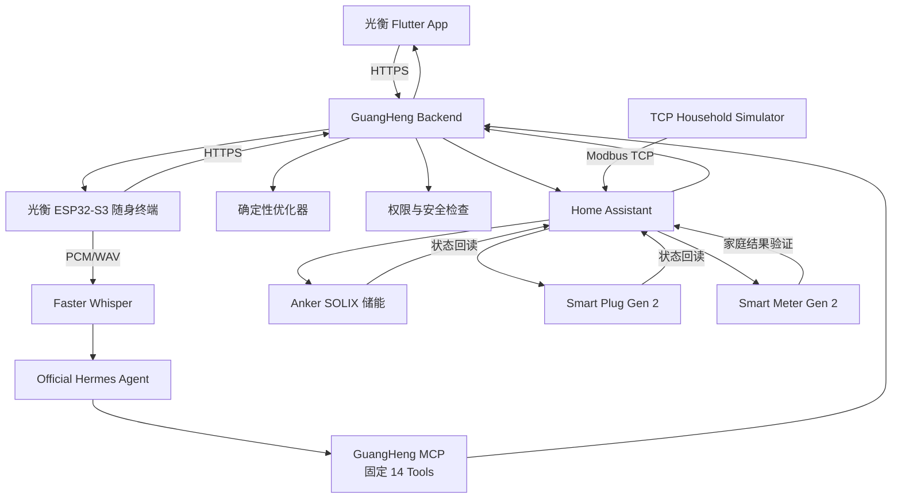

# 光衡 GuangHeng Backend

> 面向家庭光伏、储能、电网和可控负载的主动式能源决策与执行中枢。


---

## 项目简介

光衡 Backend 是整个光衡家庭能源系统的控制中枢。

它持续连接 Home Assistant，统一理解家庭中的：

- 光伏发电；
- 家庭负载；
- 储能设备；
- 电网购电与反送；
- Smart Meter；
- Smart Plug；
- 天气与未来光伏；
- 电价；
- 用户策略；
- 关键负载；
- 设备权限和健康状态。

系统会持续记录服务器侧能源数据，并判断当前是否值得行动。

当需要调整设备时，Backend 会生成一套可解释、可审批、可执行、可验证的能源方案。用户可以通过 Flutter App 或光衡 ESP32-S3 随身终端查看和确认。

Backend 不把“接口返回成功”当作设备控制成功。每次控制都必须经过：

```text
用户目标
    ↓
确定性计算
    ↓
待确认方案
    ↓
权限与安全检查
    ↓
设备执行
    ↓
设备状态回读
    ↓
Smart Meter 家庭结果验证
```

---

## 生产环境

| 项目 | 当前配置 |
|---|---|
| Backend 版本 | 1.6.0 |
| 生产地址 | `https://43.155.204.194` |
| API 框架 | FastAPI |
| 数据库 | SQLite |
| 部署方式 | Docker Compose |
| 反向代理 | Nginx |
| HTTPS 证书 | Let's Encrypt IP Address Certificate |
| 设备接入 | Home Assistant |
| AI Agent | Official Hermes Agent |
| 语音识别 | Faster Whisper |
| MCP 工具数量 | 固定 14 个 |
| 当前生产状态 | 健康检查正常 |
| Energy Observer | 已启用并持续运行 |

健康检查：

```text
GET https://43.155.204.194/health
```

返回内容包括：

- 服务状态；
- Backend 版本；
- 运行环境；
- 能源观察任务状态；
- 最近一次记录时间；
- 下一次记录时间；
- 最近一次错误。

---

## 为什么需要光衡 Backend

家庭能源系统通常存在以下问题：

### 数据分散

光伏、储能、电表、智能插座、天气和电价来自不同设备或平台，用户需要自己判断这些数据之间的关系。

### 设备控制彼此独立

储能只控制储能，智能插座只控制负载，很难围绕同一个家庭目标进行协同。

### 控制成功无法证明结果成功

设备接口返回 HTTP 200，只能证明命令被接收，不能证明：

- 设备真的发生变化；
- 家庭电网功率真的下降；
- 光伏反送真的减少；
- 峰值负载真的被削减；
- 备电时间真的增加。

### 手机关闭后缺少持续记录

如果数据只依靠 Flutter 页面打开时请求，就无法形成可靠的全天历史、报表和长期决策依据。

光衡 Backend 将能源观察、记录、决策、执行和验证全部放在服务器持续运行，不依赖手机保持打开。

---

## 系统架构



---

## 核心能力

## 1. 服务器持续能源观察

Backend 通过后台任务持续读取 Home Assistant，而不是依赖 Flutter App 打开后临时获取数据。

持续观察的内容包括：

- 光伏功率；
- 家庭负载；
- 储能充电功率；
- 储能放电功率；
- 电网购电功率；
- 电网反送功率；
- 电池 SOC；
- 累计光伏发电量；
- 累计充电量；
- 累计放电量；
- Smart Meter 分相数据；
- Smart Plug 当前功率和累计电量；
- 设备在线状态；
- 数据更新时间和新鲜度。

每次有效观察会记录到服务器 SQLite 数据库中，用于：

- 今日、本周和本月报表；
- 24 小时能源趋势；
- 购电费用；
- 参考基线；
- 节省金额；
- 光伏自用率；
- 碳减排估算；
- 负载预测；
- 决策证据；
- 执行前后对比。

因此，即使用户关闭手机，服务器仍会继续记录能源变化。

---

## 2. 家庭能源统一状态

Backend 将不同设备实体统一为家庭能源状态：

```text
PV
│
▼
家庭能源总线
├── 家庭负载
├── Smart Plug 柔性负载
├── 储能系统
└── 电网
```

对上层 Flutter、ESP32-S3 和 Hermes 来说，不需要分别理解每个 Home Assistant Entity。

系统统一输出：

- 当前能源流；
- 家庭供需关系；
- 电网方向；
- 储能状态；
- 数据来源；
- 数据新鲜度；
- 当前可用控制能力；
- Smart Meter 是否可用；
- 是否存在待处理方案。

---

## 3. 动态多设备发现

Backend 不把业务逻辑固定绑定到某个 Entity ID。

设备发现流程为：

```text
Home Assistant Entity / Device Registry
                ↓
设备型号和实体后缀识别
                ↓
Profile Catalog 匹配
                ↓
设备类型识别
                ↓
Capability Set
                ↓
读取能力与控制能力
```

系统支持三类核心能源资产：

| 资产类型 | 系统角色 |
|---|---|
| `storage` | 储能缓冲与能源执行器 |
| `meter` | 家庭能源真相源和结果验证器 |
| `controllable_load` | 可调节家庭负载执行器 |

Optimizer 不需要识别具体产品代码，只需要识别设备具备哪些能力。

---

## 4. Profile Catalog

Profile Catalog 描述每种设备：

- 产品型号；
- 资产类型；
- 可读取数据；
- 可控制能力；
- 控制范围；
- 调整步进；
- Home Assistant 实体映射；
- 写入服务；
- 状态回读方式；
- 是否完成验证；
- 固件或集成版本要求。

当前已覆盖：

| 设备 | 类型 | 当前能力 |
|---|---|---|
| Anker SOLIX Solarbank 4 E5000 Pro | 储能 | SOC、功率、备电、充放电限制等 |
| Anker SOLIX Solarbank Max AC | 储能 | AC 耦合储能能力发现 |
| Anker SOLIX XE AC | 储能 | AC 储能能力发现 |
| Anker SOLIX Solarbank Max | 储能 | 储能与光伏能力发现 |
| Anker SOLIX XE | 储能 | 储能与光伏能力发现 |
| Anker SOLIX Smart Meter Gen 2 | 电表 | 双 CT、三相功率、电流、电压和电量 |
| Anker SOLIX Smart Plug Gen 2 | 可控负载 | 当前功率、累计电量和开关控制 |

新设备接入时，优先增加 Profile 和能力映射，而不是把产品型号写死在业务流程中。

---

## 5. HA Area 家庭负载

Backend 读取 Home Assistant 的：

- Area Registry；
- Device Registry；
- Entity Registry；
- 当前 Entity State。

系统按照家庭空间聚合负载，例如：

```text
家庭负载 5.1 kW

├── 厨房       1.8 kW
├── 客厅       0.9 kW
├── 洗衣房     0.6 kW
├── 工作区     0.4 kW
└── 未分配     1.4 kW
```

为了避免重复计算，以下实体不会重复计入普通房间负载：

- 光伏发电；
- 储能充电；
- 储能放电；
- 电网购电；
- 电网反送；
- Smart Meter 相位统计。

没有分配 Area 的功率实体会单独返回，方便用户修正 Home Assistant 配置。

---

## 6. 24 小时能源计划

Backend 根据以下信息生成 24 小时能源计划：

- 当前电池 SOC；
- 当前光伏功率；
- 当前家庭负载；
- 未来光伏预测；
- 未来负载预测；
- 当前电价；
- 用户策略；
- 备电目标；
- 储能容量和功率边界；
- 关键负载需求。

计划用于表达未来每个时间段的能源方向：

- 光伏供电；
- 电池充电；
- 电池放电；
- 电网购电；
- 备用时段。

所有具体目标数值由确定性优化器计算，保证同样输入得到可复现结果。

Hermes 不负责凭感觉生成储能功率或设备目标值。

---

## 7. Autopilot 主动决策

光衡会持续判断：

> 当前是否真的值得行动？

自主决策流程为：

```text
后台调度
    ↓
读取最新 Decision Context
    ↓
确定性 Optimizer 计算
    ↓
记录 Decision Run
    ↓
判断是否需要行动
    ├── 不需要：保持安静
    └── 需要：生成 PENDING Proposal
                    ↓
               生成通知
                    ↓
               等待用户授权
```

Autonomous Decision 不等于 Autonomous Execution。

主动决策模块可以：

- 观察家庭状态；
- 发现机会；
- 运行优化计算；
- 生成待确认方案；
- 生成结构化通知。

但不能：

- 自己批准 Proposal；
- 绕过用户权限；
- 直接执行设备控制；
- 绕过 Safety；
- 直接调用 Home Assistant 写服务；
- 跳过设备回读和 Smart Meter 验证。

---

## 8. Strategy 用户策略

用户可以选择：

| 策略 | 主要目标 |
|---|---|
| SAVE | 优先降低购电费用和减少高价时段用电 |
| AUTO | 平衡节省、光伏自用率和家庭用电体验 |
| BACKUP | 优先保留电池电量和家庭备电能力 |

策略不是一个简单标签。

Backend 会根据策略改变：

- 备电目标；
- 充放电倾向；
- 电价敏感程度；
- 光伏余电使用方式；
- 关键负载保护程度；
- 建议触发条件；
- 预计收益的表达方式。

例如在 BACKUP 模式中，系统允许电费小幅增加，以换取更长的关键负载支撑时间。

---

## 9. Proposal 待确认方案

当系统发现值得行动的机会时，会创建 `PENDING` Proposal。

Proposal 包含：

- 行动原因；
- 当前值；
- 目标值；
- 影响设备；
- 能力名称；
- 预计结果；
- 不执行的预计影响；
- 数据来源；
- 生成时间；
- 当前状态；
- 安全与权限信息。

用户可以：

```text
批准
拒绝
暂不执行
```

通知已读不等于批准。

Hermes 解释方案也不等于批准。

---

## 10. 跨设备 Action Set

当一个家庭能源目标需要多台设备协同时，Backend 会把多个动作组成一个 Action Set。

例如“吸收光伏余电”：

```text
Action Set：吸收光伏余电

├── Solarbank XE AC
│   └── 充放电方向：放电 → 充电
│
├── Solarbank XE AC
│   └── 储能功率：0 W → 1200 W
│
├── Solarbank Max
│   └── 充放电方向：放电 → 充电
│
└── Solarbank Max
    └── 储能功率：0 W → 1100 W
```

用户只确认一次，Backend 再逐项执行。

执行原则：

- 每一步执行前重新检查；
- 任意一步失败后停止后续动作；
- 不因为前一步成功而忽略后续异常；
- 保存每个子动作的执行记录；
- 最终生成统一验证结果。

---

## 11. Safety 安全检查

设备写入前必须检查：

- 用户控制权限；
- 设备是否在线；
- 数据是否过期；
- 设备是否绑定；
- 设备类型是否匹配；
- Capability 是否存在；
- Capability 是否允许写入；
- 对应控制是否完成验证；
- 当前值是否发生变化；
- 目标值是否在安全范围内；
- 目标值是否满足调整步进；
- Proposal 是否仍为 `PENDING`；
- Action Set 版本是否一致；
- 授权凭证是否有效；
- 是否存在重放请求。

未通过检查时，系统返回明确阻断原因，不尝试设备写入。

---

## 12. 执行与设备回读

Backend 通过 Home Assistant Service 完成设备控制。

支持的统一写入类型包括：

| 类型 | Home Assistant 服务示例 |
|---|---|
| 数字设置 | `number.set_value` |
| 模式选择 | `select.select_option` |
| 开关控制 | `switch.turn_on` / `switch.turn_off` |

执行后不会立即宣布成功。

Backend 会重新读取对应 Entity，判断设备是否真正到达目标状态。

```text
命令发送成功
    ≠
设备已经执行成功
```

只有真实状态回读一致，才能标记：

```text
READBACK_VERIFIED
```

---

## 13. Smart Meter 三级验证

执行闭环分为三个层级：

| 层级 | 验证内容 |
|---|---|
| L1 命令确认 | Home Assistant 或设备是否接受命令 |
| L2 设备确认 | 对应设备状态是否实际变化 |
| L3 家庭结果确认 | Smart Meter 是否证明家庭能源目标实现 |

例如：

```text
执行前电网反送：2300 W
              ↓
储能开始充电
              ↓
柔性负载开始运行
              ↓
设备状态回读成功
              ↓
Smart Meter 再次读取
              ↓
电网反送下降
              ↓
VERIFIED
```

只有命令、设备状态和家庭结果一致时，系统才会返回最终验证成功。

如果设备已经调整，但 Smart Meter 数据不可用，Backend 会返回：

```text
设备已调整
家庭能源效果未验证
```

不会错误地显示“已验证”。

---

## 14. Smart Meter Gen 2

Smart Meter 在光衡中不是一个普通数据卡片，而是：

```text
Observer
Verifier
Safety Sensor
Report Ground Truth
```

支持读取：

- 主 CT 总有功功率；
- 副 CT 总有功功率；
- 无功功率；
- 功率因数；
- 正向累计电量；
- 反向累计电量；
- L1/L2/L3 有功功率；
- L1/L2/L3 电流；
- L1/L2/L3 电压。

字段不可用时保持为空，不使用 `0` 代替真实数据。

Smart Meter 是报表、电网购电、反送、削峰和 Action Set 最终验证的重要真相源。

---

## 15. Smart Plug Gen 2

Smart Plug 将光衡从“储能优化”扩展为“能源供给与需求共同优化”。

Backend 可以管理：

- 当前开关状态；
- 当前功率；
- 累计电量；
- 负载所属区域；
- 是否为关键负载；
- 是否允许调度；
- 最早开始时间；
- 最晚完成时间；
- 最短运行时间；
- 是否允许中断；
- 用户控制权限。

可用于：

- 热水器；
- 洗衣机；
- 烘干机；
- 除湿机；
- 充电设备；
- 其他柔性负载。

Smart Plug 不允许由 LLM 随意开关，所有控制都要经过用户权限和 Safety。

---

## 16. 关键负载与家庭韧性

用户可以配置关键负载，例如：

- 冰箱；
- 路由器；
- 基础照明；
- 安防设备；
- 医疗设备。

Backend 根据：

- 储能可用电量；
- 当前 SOC；
- 备用预留；
- 放电效率；
- 关键负载总功率；

计算预计支撑时间。

没有配置关键负载或缺少必要数据时返回空值，不伪造备电小时数。

BACKUP 场景可以表达：

```text
预计增加电费：¥1.42
预计备电时间：4.1 小时 → 7.3 小时
```

让用户知道成本增加换来了什么实际价值。

---

## 17. Hermes AI

光衡接入 Official Hermes Agent。

Hermes 负责：

- 理解用户自然语言；
- 回答家庭能源问题；
- 解释当前状态；
- 解释方案为什么值得执行；
- 理解 What-if 问题；
- 识别用户目标；
- 调用受限的光衡 MCP 工具。

Hermes 不负责：

- 直接生成设备功率；
- 自己批准 Proposal；
- 自己执行 Action Set；
- 直接调用 Home Assistant 写服务；
- 绕过用户权限；
- 绕过 Safety；
- 修改数据库权限；
- 读取服务器密钥。

### AI 与确定性优化分工

| 模块 | 职责 |
|---|---|
| Hermes | 理解、解释、对话和意图识别 |
| Deterministic Optimizer | 数值计算、目标值、边界和约束 |
| Safety | 权限、在线状态、范围和新鲜度检查 |
| Execution | 调用设备服务并保存执行记录 |
| Readback | 重新读取设备状态 |
| Smart Meter Verification | 判断家庭目标是否真正实现 |

---

## 18. MCP 安全边界

GuangHeng MCP Server 仅绑定：

```text
127.0.0.1:8001
```

工具数量固定为：

```text
14 Tools
```

工具集合中没有：

- Proposal 审批工具；
- Action Set 执行工具；
- Home Assistant 写入工具；
- 终端命令工具；
- 文件系统控制工具；
- SSH 工具；
- 浏览器自动控制工具。

即使 Hermes 产生了错误回答，也无法通过 MCP 绕过 Backend 的授权与执行边界。

MCP 不通过 Nginx 暴露到公网。

---

## 19. 光衡 ESP32-S3 随身终端支持

Backend 为光衡随身终端提供独立认证和精简 Snapshot。

主要接口：

```text
POST /api/v1/companion/pairing/device-code
POST /api/v1/companion/pairing/confirm
POST /api/v1/companion/pairing/poll

GET  /api/v1/companion/devices
POST /api/v1/companion/devices/{device_uid}/revoke

GET  /api/v1/companion/snapshot
POST /api/v1/companion/voice
POST /api/v1/companion/action-sets/{action_set_id}/approve
```

### 安全配对

```text
ESP32-S3 请求短时配对码
          ↓
Flutter 输入 6 位配对码
          ↓
Backend 确认设备身份
          ↓
ESP32-S3 获得可撤销设备凭证
          ↓
后续请求使用独立设备认证
```

配对码：

- 短时有效；
- 一次性使用；
- 由 Backend 动态生成；
- 不在固件中固定；
- 不包含 Home Assistant 或 AI 密钥。

### Companion Snapshot

Snapshot 向 ESP32-S3 提供：

- 家庭能源状态；
- 数据来源模式；
- 数据过期状态；
- 最近同步时间；
- Pending Action Set；
- 一次性确认挑战；
- 当前执行状态；
- 子动作状态；
- Smart Meter 验证结果；
- 执行前后电网功率。

---

## 20. 语音服务

光衡 ESP32-S3 随身终端通过：

```text
POST /api/v1/companion/voice
```

上传真实麦克风采集的短时 WAV 音频。

处理流程：

```text
ESP32-S3 麦克风
    ↓
HTTPS WAV 上传
    ↓
Backend 临时接收
    ↓
Faster Whisper ASR
    ↓
Official Hermes
    ↓
结构化意图与回答
    ↓
返回 ESP32-S3
```

隐私处理原则：

- 原始 WAV 仅用于本次识别；
- ASR 完成后删除临时音频；
- SQLite 只保存必要的会话元数据；
- 不保存模型推理过程；
- 不保存 Authorization Header；
- 不保存模型服务密钥；
- 不保存原始系统提示词。

语音中的“批准”不会绕过实体长按或现有权限体系。

---

## 21. 报表与价值证明

Backend 提供今日、本周和本月能源报表。

包括：

- 总用电量；
- 光伏自用率；
- 电网购电量；
- 智能节省金额；
- 参考基线费用；
- 实际购电费用；
- 累计节省；
- 碳减排估算；
- 决策与执行记录；
- 家庭能源韧性；
- 日历购电支出。

报表来源于服务器持续记录，不依赖 Flutter App 保持打开。

金额计算遵循：

```text
购电费用 = 电网购电量 × 对应电价
```

参考基线与实际购电使用相同统计周期和统一电价口径，避免把不同时间范围的数据直接比较。

---

## 22. 多设备家庭物理模拟器

比赛环境使用 TCP Simulator，但不是多台互不相关的随机设备。

模拟器使用共享家庭能源世界：

```text
光伏发电
+ 电网购电
+ 储能放电
=
基础负载
+ Smart Plug 负载
+ 储能充电
+ 电网反送
```

当一台设备发生动作时，其他设备读数会同步变化。

例如：

```text
PV                  = 4.2 kW
Base Home Load      = 1.1 kW
Smart Plug          = 0.8 kW
Battery Charge      = 1.2 kW

Smart Meter Grid
= Home Load + Battery Charge - PV
```

模拟器持续计算：

- 储能 SOC；
- 充放电累计电量；
- Smart Plug 累计用电；
- Smart Meter 购电量；
- Smart Meter 反送电量；
- 家庭负载；
- 电网瞬时功率。

数据来源会明确标记：

```text
source_mode = simulator
```

不会伪装为真实家庭硬件。

---

## 真实闭环示例

### 减少光伏反送

```text
Smart Meter 检测：
电网反送 2300 W
        ↓
Backend 判断：
存在明显光伏余电
        ↓
Optimizer 生成：
跨设备 Action Set
        ↓
Flutter / ESP32-S3 展示：
减少光伏反送
        ↓
用户确认一次
        ↓
Safety 逐项检查
        ↓
多台储能协同充电
        ↓
逐台设备状态回读
        ↓
Smart Meter 再次测量
        ↓
电网反送下降约 2300 W
        ↓
Action Set = SUCCEEDED
Verification = VERIFIED
```

当前真实服务器闭环证据中：

- Action Set 包含 4 项设备动作；
- 4 个子 Proposal 均生成执行记录；
- 所有执行均为 `SUCCEEDED`；
- 所有设备均完成 `READBACK_VERIFIED`；
- Smart Meter 测得家庭电网变化 2300 W；
- 最终统一验证状态为 `VERIFIED`。

---

## 24 小时可演示原型

1. TCP 家庭模拟器持续生成符合能量守恒的家庭能源状态。
2. Home Assistant 接入多台 Anker SOLIX 储能、Smart Plug 和 Smart Meter。
3. Backend 在手机关闭后继续读取并记录能源数据。
4. 中午出现明显光伏余电，Smart Meter 检测到 2300 W 电网反送。
5. Autopilot 判断当前值得行动。
6. Backend 生成“减少光伏反送”的跨设备 Action Set。
7. Flutter App 和光衡 ESP32-S3 随身终端同时显示方案。
8. 用户查看行动原因、受影响设备和预计结果。
9. 用户在 Flutter 确认，或在 ESP32-S3 上长按确认。
10. Backend 使用最新状态重新完成权限与安全检查。
11. 系统逐项调整多台储能和柔性负载。
12. 每个动作执行后重新读取设备状态。
13. 任意一步失败时，后续动作立即停止。
14. 全部设备完成后，Smart Meter 再次读取家庭电网功率。
15. 系统比较执行前后的真实读数。
16. 目标达到后，Flutter 和 ESP32-S3 同时显示“方案已完成，结果已验证”。
17. 决策、审批、执行、设备回读和 Smart Meter 验证全部写入同一条时间线。
18. 用户也可以通过语音说：“现在光伏有多余，把电池充起来。”
19. Faster Whisper 完成识别，Hermes 理解用户目标。
20. 所有语音请求仍然进入相同的权限、安全、执行和验证闭环。

---

## 主要 API

### 系统与连接

```text
GET /health
GET /api/v1/health/summary
GET /api/v1/home-assistant/connection
```

### 家庭能源

```text
GET /api/v1/energy/state
GET /api/v1/energy/today
GET /api/v1/energy/balance
GET /api/v1/energy/schedule/24h
GET /api/v1/household-energy/graph
```

### 设备

```text
GET   /api/v1/devices
GET   /api/v1/devices/discover
GET   /api/v1/devices/discover/bound
GET   /api/v1/devices/profiles/catalog
GET   /api/v1/devices/{device_id}/state
POST  /api/v1/devices/{device_id}/bind
PATCH /api/v1/devices/{device_id}
```

### Smart Meter 与家庭负载

```text
GET /api/v1/meters/{device_id}/insight
GET /api/v1/areas/load-view
```

### 设备控制方案

```text
POST /api/v1/devices/{device_id}/control-proposals
POST /api/v1/devices/{device_id}/switch-proposals
```

### 策略、预测和优化

```text
GET /api/v1/strategy
PUT /api/v1/strategy

GET /api/v1/weather
GET /api/v1/solar-forecast
GET /api/v1/load-forecast
GET /api/v1/tariff
GET /api/v1/decision-context
POST /api/v1/optimizer/evaluate
```

### Proposal

```text
GET  /api/v1/proposals
POST /api/v1/proposals/generate
GET  /api/v1/proposals/{proposal_id}
POST /api/v1/proposals/{proposal_id}/approve
POST /api/v1/proposals/{proposal_id}/reject
```

### Action Set

```text
GET  /api/v1/action-sets
GET  /api/v1/action-sets/pending
POST /api/v1/action-sets/generate
GET  /api/v1/action-sets/{action_set_id}
POST /api/v1/action-sets/{action_set_id}/approve
POST /api/v1/action-sets/{action_set_id}/reject
```

### 执行记录

```text
GET /api/v1/executions
GET /api/v1/executions/{execution_id}
```

### Autopilot 与通知

```text
GET   /api/v1/autonomy/status
POST  /api/v1/autonomy/run
GET   /api/v1/autonomy/decisions
GET   /api/v1/autonomy/decisions/{run_id}
GET   /api/v1/notifications
PATCH /api/v1/notifications/{event_id}/read
```

### Hermes

```text
POST /api/v1/hermes/sessions
GET  /api/v1/hermes/sessions/{session_id}
GET  /api/v1/hermes/sessions/{session_id}/messages
POST /api/v1/hermes/chat
```

### 报表

```text
GET /api/v1/report/energy
```

### 光衡随身终端

```text
POST /api/v1/companion/pairing/device-code
POST /api/v1/companion/pairing/confirm
POST /api/v1/companion/pairing/poll
GET  /api/v1/companion/devices
POST /api/v1/companion/devices/{device_uid}/revoke
GET  /api/v1/companion/snapshot
POST /api/v1/companion/voice
POST /api/v1/companion/action-sets/{action_set_id}/approve
```

---

## 项目结构

```text
guangheng_server/
├── app/
│   ├── api/v1/
│   ├── core/
│   ├── main.py
│   └── modules/
│       ├── action_set/
│       ├── area_energy/
│       ├── autonomy/
│       ├── companion/
│       ├── critical_load/
│       ├── decision_context/
│       ├── device_registry/
│       ├── energy_state/
│       ├── execution/
│       ├── hermes/
│       ├── home_assistant/
│       ├── household_graph/
│       ├── load_forecast/
│       ├── optimizer/
│       ├── proposal/
│       ├── report/
│       ├── safety/
│       ├── solar_array/
│       ├── solar_forecast/
│       ├── station/
│       ├── strategy/
│       ├── system_health/
│       ├── tariff/
│       └── weather/
├── config/
│   ├── autonomy_policy.yaml
│   ├── device_profiles.yaml
│   ├── energy_observation_policy.yaml
│   ├── optimizer_policy_v2.yaml
│   ├── report_policy.yaml
│   ├── simulator_energy_policy.yaml
│   ├── solix_capability_matrix.yaml
│   ├── strategy_policy.yaml
│   └── tariff_policy.yaml
├── docs/
├── models/
├── storage/
├── tests/
├── Dockerfile
├── docker-compose.yml
└── requirements.txt
```

---

## 本地开发

### 创建虚拟环境

```bash
python -m venv .venv
```

Windows：

```powershell
.\.venv\Scripts\Activate.ps1
```

Linux：

```bash
source .venv/bin/activate
```

### 安装依赖

```bash
pip install -r requirements.txt
```

### 配置环境

复制示例配置：

```bash
cp .env.example .env
```

需要配置的内容包括：

```dotenv
ENVIRONMENT=development
HOST=127.0.0.1
PORT=8000

DATABASE_URL=sqlite:///./storage/guangheng.db

HOME_ASSISTANT_BASE_URL=
HOME_ASSISTANT_TOKEN=

HERMES_BASE_URL=http://127.0.0.1:8642
HERMES_API_KEY=
HERMES_MODEL=hermes-agent
```

不要把以下内容提交到 Git：

- `.env`；
- Home Assistant Token；
- Hermes Gateway Key；
- AI 模型服务密钥；
- Companion 设备凭证；
- TLS 私钥；
- SQLite 生产数据库；
- SSH 凭据。

### 启动 Backend

```bash
uvicorn app.main:app --host 127.0.0.1 --port 8000
```

开发文档：

```text
http://127.0.0.1:8000/docs
```

健康检查：

```text
http://127.0.0.1:8000/health
```

---

## 测试

执行完整测试：

```bash
pytest -q
```

当前 Backend 1.6.0 已记录的完整回归结果：

```text
156 passed
```

测试覆盖：

- 能源状态；
- Energy Observation；
- 今日能源数据；
- 24 小时计划；
- 天气；
- 光伏预测；
- 负载预测；
- 电价；
- Optimizer V1/V2；
- Proposal；
- Safety；
- Execution；
- Action Set；
- 自主决策；
- 通知；
- 关键负载；
- 设备健康诊断；
- Profile Catalog；
- 多设备发现；
- HA Area；
- Smart Plug；
- Smart Meter；
- 多设备 Simulator；
- P2 储能型号；
- 光伏阵列；
- Hermes；
- MCP 工具；
- Companion 配对；
- Companion Snapshot；
- Companion 语音；
- Companion Action Set 确认。

---

## Docker 部署

构建镜像：

```bash
docker build -t guangheng-server:1.6.0 .
```

启动：

```bash
docker compose up -d
```

查看服务：

```bash
docker compose ps
```

查看日志：

```bash
docker compose logs -f guangheng-api
```

部署时必须保留：

```text
./storage
```

升级不能删除或覆盖现有 SQLite 数据。

禁止把 `.env`、Home Assistant Token 或模型密钥打入 Docker 镜像。

---

## Production HTTPS

生产请求链：

```text
Flutter / ESP32-S3
        ↓
https://43.155.204.194:443
        ↓
Nginx
        ↓
http://127.0.0.1:8000
        ↓
GuangHeng Backend
```

公网端口策略：

| 端口 | 状态 |
|---|---|
| 80 | 仅 ACME 和 HTTPS 跳转 |
| 443 | 对外提供 GuangHeng HTTPS API |
| 8000 | 仅回环地址 |
| 8001 | 仅回环地址，MCP |
| 8123 | 不允许公网访问 |
| 502 | 不允许公网访问 |
| 8642 | 不允许公网访问 |
| 18555 | 不允许公网访问 |
| 2375/2376 | 不监听 |

Nginx 不代理：

```text
/mcp
/ha
Home Assistant
Modbus
Hermes Gateway
```

---

## 数据库与审计

SQLite 保存：

- 设备注册信息；
- 能源观察记录；
- 用户策略；
- Proposal；
- Action Set；
- Action Set Item；
- Execution；
- 自主决策记录；
- 通知；
- 关键负载；
- Hermes 会话元数据；
- Companion 设备与配对状态。

不保存：

- 原始 Home Assistant 完整响应；
- 原始语音 WAV；
- AI 模型推理过程；
- Authorization Header；
- TLS 私钥；
- Home Assistant Token；
- 模型服务密钥。

每次决策、审批、执行、设备回读和家庭验证都可以在同一条时间线上追溯。

---

## 真实性边界

### 当前已完成

- 生产 HTTPS Backend 1.6.0；
- 服务器持续能源观察；
- SQLite 历史记录；
- Home Assistant 接入；
- 动态多设备发现；
- Profile Catalog；
- HA Area 家庭负载；
- Smart Meter 分项计量；
- Smart Plug 控制闭环代码；
- 多型号储能能力发现；
- Strategy；
- 24 小时能源计划；
- Proposal；
- Action Set；
- Safety；
- Execution；
- 设备状态回读；
- Smart Meter L1/L2/L3 验证；
- Official Hermes；
- 固定 14 个 MCP Tools；
- Companion 配对；
- Companion Snapshot；
- Companion 语音接口；
- ESP32-S3 长按确认；
- 156 项 Backend 回归测试。

### 当前比赛环境

当前生产演示使用：

```text
Home Assistant
+
Anker SOLIX Official Integration
+
TCP Household Simulator
```

因此能源数据属于真实服务器运行的 Simulator 数据，不等同于真实家庭硬件长期数据。

### 尚未宣称完成

- 真实家庭长期节省率；
- 大规模用户准确率；
- 大规模生产用户数量；
- Smart Plug Gen 2 实体设备开关回读验收；
- 所有新储能型号的实体设备写入验证；
- 官方集成未提供时的 MPPT 组件级数据；
- 厂商售后与工单闭环。

这些项目不能通过 Simulator 测试替代真实硬件或长期运营证据。

---

## 关联项目

- Flutter App：[bandu111/guangheng](https://github.com/bandu111/guangheng)
- 光衡 ESP32-S3 随身终端：Waveshare ESP32-S3-Touch-AMOLED-1.8
- Anker SOLIX Home Assistant 官方集成：[ha-anker-solix-official](https://github.com/anker-charging/ha-anker-solix-official)
- Official Hermes Agent：[NousResearch/hermes-agent](https://github.com/NousResearch/hermes-agent)
- 生产 API：`https://43.155.204.194`

---

## 项目定位

光衡不是一个只负责显示能源数据的 Dashboard，也不是一个让 AI 随意控制设备的聊天机器人。

它是一个能够持续观察、主动判断、受控执行并证明结果的家庭能源 Agent：

```text
持续观察
    ↓
预测变化
    ↓
发现机会
    ↓
生成可解释方案
    ↓
等待用户授权
    ↓
完成安全检查
    ↓
协调多台设备
    ↓
重新读取设备状态
    ↓
Smart Meter 验证家庭结果
    ↓
记录实际价值
```

光衡的目标不是让用户更频繁地查看能源数据，而是让系统在真正值得行动时主动帮助用户完成家庭能源决策。
