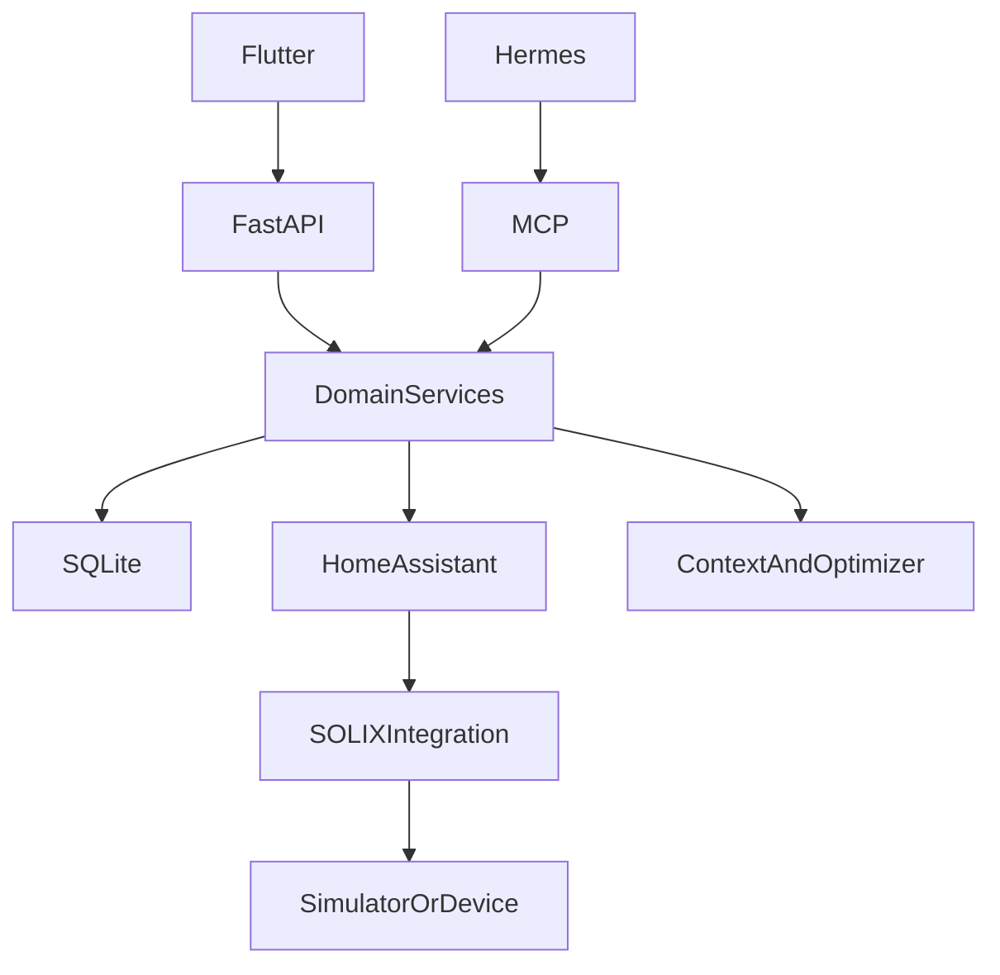
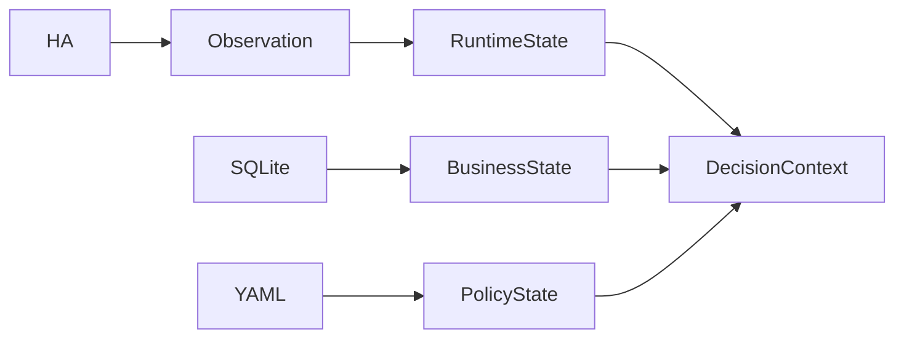
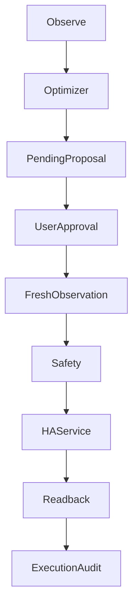

# 光衡 GuangHeng Backend V1.1

## Autonomous Energy Agent 当前架构、控制边界与部署验收报告

**版本：** V1.1  
**更新日期：** 2026-09-21  
**项目目录：** `E:\PythonProject\guangheng_server`  
**运行技术栈：** Python 3.11 / FastAPI / SQLAlchemy / SQLite / Pydantic v2  
**设备数据源：** Anker SOLIX Official Integration，当前 `source_mode=simulator`  
**生产 API：** `http://43.155.204.194:8000`，当前为比赛阶段临时 HTTP 地址

> 本报告基于当前磁盘代码、YAML 策略、SQLite 模型、OpenAPI、100 项自动化测试、本地 Docker 容器和生产只读 API 验收更新。报告不包含 Token、Authorization Header、模型密钥、SSH 凭证或数据库内容。

---

## 验收结论摘要

| 项目 | 当前结果 |
|---|---:|
| Python 本地运行时 | 3.11.9 |
| Docker Python | 3.11.16 |
| pytest | 100 passed / 0 failed |
| OpenAPI | 36 paths / 37 operations |
| Docker Image | `guangheng-server:1.0.0` |
| Image 平台与大小 | linux/amd64 / 76.39 MB |
| 容器健康 | `healthy` |
| Uvicorn | 1 worker，无 reload |
| Production `/health` | HTTP 200，`status=ok` |
| Production Energy | `available=true` |
| 当前设备来源 | `simulator` |
| 当前策略 | AUTO，Reserve Target 30% |
| Scheduler | `enabled=false` |
| Proposal / Execution 审计 | 4 / 1，本轮只读验收无增量 |
| Hermes / MCP 服务器部署 | 未部署到公网服务器 |

当前 GuangHeng 已形成两条彼此隔离的闭环：

- **核心控制闭环：** Observation → Decision → Proposal → Approval → Safety → Execution → Readback。
- **自治建议闭环：** Decision Context → Optimizer V2 → PENDING Proposal → Notification → 等待用户批准。

自治系统不会直接执行设备写入。Hermes 负责解释和工具编排，但没有 Approval、Execution 或 Home Assistant 写工具。

## 1. 产品与系统定位

GuangHeng Backend 是家庭能源智能调度 Control Plane。它通过 Home Assistant 读取 Anker SOLIX Runtime，将当前能量状态、天气、光伏预测、负载预测、电价和用户策略组合成结构化 Decision Context，再由确定性 Optimizer 生成可解释建议。

系统核心原则：

- Home Assistant 是设备 Runtime Truth。
- SQLite 是 GuangHeng Business Truth。
- YAML 是 Capability、Policy 与参考因子的 Configuration Truth。
- LLM 不生成设备控制目标，Optimizer V2 是目标值的唯一来源。
- Proposal 必须经用户批准，Execution 前必须重新读取 Runtime 并通过 Safety。
- HTTP 200 不代表设备执行成功，只有 Readback 与目标一致才成功。
- Simulator 与真实设备走同一条 Safety 和 Execution 路径，不存在 Demo bypass。

## 2. 当前总体架构



**图 1：当前系统总体架构**

| 层级 | 职责 | 当前状态 |
|---|---|---|
| Flutter Client | 展示、刷新、策略选择、审批入口 | 已接生产 API 环境配置 |
| FastAPI | HTTP Contract 与依赖注入 | 已部署 Docker |
| Domain Services | 能源、预测、决策、控制业务 | 已完成 V1.1 |
| SQLite | 设备绑定、策略、提案、执行、自治与会话审计 | 持久化挂载 |
| Home Assistant | 当前设备状态与服务调用 | 已连接 |
| SOLIX Integration | 官方 Entity 与 Service 能力 | 当前连接 Simulator |
| Hermes | 用户发起的 Agent 解释 | 本地独立运行，服务器未部署 |
| MCP | 14 个 allow-list 工具 | 仅本地私有访问 |

## 3. 项目模块结构

```text
app/modules/
├─ home_assistant/       # HA REST、历史与 Service 调用
├─ device_registry/      # Discovery、绑定、Capability Runtime
├─ energy_state/         # 当前能源、平衡、今日累计、24h 调度
├─ weather/              # Open-Meteo 天气上下文
├─ solar_forecast/       # 光伏预测
├─ load_forecast/        # 负载预测
├─ tariff/               # 中国居民参考平均电价
├─ decision_context/     # 决策上下文聚合
├─ optimizer/            # Deterministic Optimizer / Optimizer V2
├─ strategy/             # SAVE / AUTO / BACKUP
├─ proposal/             # Proposal 状态机与审批
├─ safety/               # 执行前安全门
├─ execution/            # HA 写入与 Readback
├─ autonomy/             # 自治决策、通知、Scheduler
├─ hermes/               # Session、Gateway Client、MCP Tools
└─ report/               # 费用、节省与碳减排报表
```

运行时配置位于 `config/`：

| 配置 | 用途 |
|---|---|
| `solix_capability_matrix.yaml` | Entity 映射、access、verified、min/max/step |
| `strategy_policy.yaml` | SAVE=20%、AUTO=30%、BACKUP=80% |
| `optimizer_policy_v2.yaml` | AUTO 阈值、预测周期和目标 Reserve |
| `tariff_policy.yaml` | 0.54 CNY/kWh 全国参考平均价 |
| `report_policy.yaml` | 费用 Baseline 与碳排放因子 |
| `autonomy_policy.yaml` | Scheduler、去重与运行超时 |
| `hermes_mcp.example.yaml` | MCP allow-list 示例配置 |

## 4. 数据所有权与时间语义



**图 2：数据所有权与 Decision Context**

| 数据类型 | 所有者 | 示例 |
|---|---|---|
| Runtime | Home Assistant | SOC、Solar、Load、Reserve、online |
| Observation | GuangHeng 当前请求 | `observed_at` |
| Business State | SQLite | Strategy、Proposal、Execution、Notification |
| Policy | YAML | 目标、阈值、verified、参考价格、碳因子 |
| External Context | Open-Meteo | 天气、辐照度、云量 |

Freshness 已区分：

- `value_changed_at`：Entity 值最后变化时间。
- `entity_reported_at`：Integration 最后报告时间。
- `entity_updated_at`：HA Entity 最后更新时间。
- `observed_at`：GuangHeng 本次真实 REST Observation 时间。
- `device_online`：当前设备在线状态。

长期稳定的 number Entity 可能数小时不变化。因此，旧 `last_reported` 只产生诊断 warning，不会在当前 HA 请求成功、设备在线且 Capability 可用时，单独把整台设备判定为 Runtime stale。Execution 前仍强制执行新的 HA Observation。

## 5. Device Discovery 与 Capability Matrix

当前已绑定设备：

| 字段 | 当前值 |
|---|---|
| Vendor | `anker_solix` |
| Model | Anker SOLIX Solarbank 4 E5000 Pro |
| Source Mode | `simulator` |
| Device Type | `storage` |
| Runtime | online，数据可读 |

当前只有 `backup_reserve` 被标记为 `verified=true`。其他控制能力即使 Entity 存在，也不能绕过 Safety 执行。

Capability 进入写路径必须同时满足：

- 设备 `control_enabled=true`。
- Proposal 状态为 APPROVED。
- Capability 在 Matrix 中声明。
- Runtime Capability `available=true`。
- access 为 `read_write`。
- Matrix 与 Runtime 都为 `verified=true`。
- Target 在 min/max 范围内且符合 step。
- 设备在线，当前 Observation 新鲜。

## 6. Energy State、Balance 与今日累计

Energy State 将 SOLIX Entity 归一为 Solar、Home Load、Battery Charging / Discharging、Grid Import / Export、SOC、Capacity、Battery Status 和数据来源。

Energy Balance 提供能量方向和功率一致性诊断。`GET /api/v1/energy/today` 通过 Home Assistant Recorder 历史，以 step-function 时间积分计算：

```text
Energy(kWh) = Σ Power(W) × Duration(hour) / 1000
```

今日发电、今日用电、购电、节省和小时流向均来自 Recorder。历史缺失时返回 unavailable 或 null，不用 0 或模拟曲线冒充真实结果。

`GET /api/v1/energy/schedule/24h` 将 Solar Forecast 与 Load Forecast 按小时对齐，生成未来 24 小时只读建议：`STORE_SURPLUS`、`SOLAR_ASSIST`、`COVER_DEFICIT`、`PRESERVE_RESERVE` 或 `UNAVAILABLE`。

该接口固定 `advisory_only=true`、`executable=false`，不会产生 Proposal 或设备写入。

## 7. Weather、Solar Forecast 与 Load Forecast

Weather Context 使用 Open-Meteo，返回当前天气与小时级外部信号。Solar Forecast 使用天气辐照度与当前光伏状态校准；Load Forecast 使用 Home Assistant Recorder 历史的小时统计。

每个 Forecast 都明确提供 `available`、`method`、小时级 points、1h/3h/6h/24h summary、confidence、`observed_at` 和结构化 `error_code`。预测不可用时 Optimizer 不会自行编造未来能源值。

## 8. Tariff Context

Tariff V1 使用中国居民用电全国参考平均价：

| 字段 | 值 |
|---|---|
| price | 0.54 CNY/kWh |
| provider | NDRC |
| pricing_type | `reference_average` |
| region | CN |
| reference_date | 2019-08-23 |
| realtime | false |

该价格不是某个家庭当前执行电价，不是动态电价，也不会被描述为实时中国电价。配置位于 YAML，而不是写死在 Service。

## 9. Decision Context 与 Optimizer V2

Decision Context 聚合：

```text
energy + balance + strategy + weather + solar_forecast + load_forecast + tariff
```

Optimizer V2 是确定性服务，不调用 LLM、不写数据库、不执行设备。AUTO 模式证据包括：

```text
Net Energy 6h  = Solar Forecast 6h  - Load Forecast 6h
Net Energy 24h = Solar Forecast 24h - Load Forecast 24h
Projected Grid Need = max(Load 24h - Solar 24h, 0)
Reference Grid Cost = Projected Grid Need × 0.54
```

AUTO Reserve 范围为 20%-50%，根据预测净能量与置信度选择 20%、30%、40% 或 50%。若 Forecast confidence 低于 MEDIUM，则保持基线，不动态调整。SAVE 与 BACKUP 使用用户策略基线。

Optimizer 输出 target、current value、action_required、reason code、confidence、evidence、policy rule 和版本。若当前值已满足目标，返回 `TARGET_ALREADY_SATISFIED`，不生成新动作。

<!-- pagebreak -->

## 10. Proposal、Approval、Safety 与 Execution



**图 3：受控执行闭环**

Safety 当前检查项：

| 检查 | 阻断条件 |
|---|---|
| HA request | 请求失败 |
| Proposal | 未批准 |
| Permissions | observe/propose/control 未开启 |
| Device | offline |
| Capability | 未声明或 unavailable |
| Observation | 本次 Observation 超龄 |
| Access | 非 read_write |
| Verification | verified=false |
| Range | Target 越界 |
| Step | Target 不符合步长 |

`last_reported` 过旧只进入 `ENTITY_REPORT_TIMESTAMP_OLD` warning 和 diagnostics；真正阻断依据是当前请求、当前设备、当前 Capability 与 `observed_at`。

Execution 流程：

1. 重新读取实时 Runtime。
2. 运行 Safety。
3. 仅在全部通过时调用 HA Service。
4. 即使 HA 返回 HTTP 200，也继续轮询 Readback。
5. Readback 与目标匹配才保存 `SUCCEEDED`。
6. 不匹配、超时或不可用均保存结构化失败结果。

历史上已完成一次 Simulator `backup_reserve` 25% → 80% 的完整执行与回读验证。当前生产策略为 AUTO，Reserve Target 为 30%。

## 11. Autonomous Decision Loop

Autonomy 是自动决策，不是自动执行：

```text
Decision Context
→ Optimizer V2
→ AutonomousDecisionRun
→ PENDING Proposal（仅 action_required=true）
→ Structured Notification
→ 等待用户批准
```

关键规则：

- Scheduler 当前 `enabled=false`。
- Scheduler 使用单进程 `asyncio.Lock`，所以 Docker 强制 1 worker。
- 相同目标的 PENDING Proposal 会复用。
- 不同目标的 PENDING Proposal 会产生 conflict，而不是覆盖。
- REJECTED Proposal 有 60 分钟冷却期。
- Notification 使用稳定 dedupe key，避免重复提醒。
- 标记通知已读不会批准 Proposal。
- No-action run 不创建 Proposal 和 ACTION_REQUIRED 通知。

## 12. Hermes 与 MCP 安全边界

Official Hermes 作为独立 Runtime，通过 DeepSeek Provider 和 GuangHeng MCP 获取工具结果。GuangHeng 不保存 DeepSeek Key，也不将 Hermes 打包进 API 容器。

MCP Registry 固定为 14 个工具：

```text
get_energy_state, get_energy_balance, get_weather,
get_solar_forecast, get_load_forecast, get_tariff,
get_strategy, get_decision_context, evaluate_optimizer,
generate_proposal, get_proposal, list_proposals,
get_execution, list_executions
```

Registry 不包含 approve、execute 或 Home Assistant write Tool。`generate_proposal` 只能创建 PENDING Proposal。Prompt Injection 无法突破 Tool Registry 的能力边界。

Hermes Session 会持久化用户消息、最终回答、经过清理的工具摘要和结构化结果；不持久化系统 Prompt、模型 reasoning、Provider Secret、Authorization Header 或原始 traceback。

当前服务器阶段：FastAPI 核心能源系统已独立部署；Hermes Runtime 未部署到服务器；MCP 8001 和 Hermes 8642 均未公开；Hermes endpoint 暂时 unavailable 不影响核心能源、策略和控制功能。

## 13. Energy Report、费用与碳减排

`GET /api/v1/report/energy` 返回 today / week / month 聚合和 daily points。

费用公式：

```text
Reference Baseline Cost = Home Consumption × 0.54
Actual Grid Cost = Grid Import × 0.54
Savings = max(Reference Baseline Cost - Actual Grid Cost, 0)
```

碳减排公式：

```text
Avoided Grid Energy = max(Home Consumption - Grid Import, 0)
Carbon Reduction = Avoided Grid Energy × 0.6096 kgCO2/kWh
```

碳因子采用 2023 年全国电力平均二氧化碳排放因子 0.6096 kgCO2/kWh，配置来源标记为 `MEE_NBS`。报告返回价格与碳因子的 provider、reference year/date、realtime 标记和计算方法。

当前数据来自 Simulator Recorder，因此计算链路是真实的，但结果质量仍受 Simulator 输出真实性限制。例如 Simulator 在夜间持续输出光伏功率时，Backend 不会擅自修正为零。

## 14. SQLite 持久化

| 表 | 内容 |
|---|---|
| `devices` | 设备身份、绑定与权限 |
| `strategy_configs` | 当前策略与 Reserve Target |
| `proposals` | 控制意图与审批状态 |
| `executions` | 命令与 Readback 审计 |
| `autonomous_decision_runs` | 自治决策证据与结果 |
| `notification_events` | 结构化通知与去重状态 |
| `agent_sessions` | GuangHeng / Hermes 会话映射 |
| `agent_messages` | 用户与最终回答审计 |
| `agent_tool_calls` | 清理后的工具调用结果 |

Home Assistant 的实时状态和原始历史不会复制进 SQLite。Docker 使用 `./storage:/app/storage` 持久化数据库，数据库不打入 Image。

## 15. API 接口清单

### 15.1 Runtime 与 Context

| Method | Path | 作用 |
|---|---|---|
| GET | `/health` | 服务健康状态 |
| GET | `/api/v1/home-assistant/connection` | HA 连接检查 |
| GET | `/api/v1/devices/discover` | Device Discovery |
| GET | `/api/v1/devices` | 已绑定设备 |
| GET | `/api/v1/devices/{id}/state` | 当前设备 Runtime |
| GET | `/api/v1/energy/state` | 当前家庭能源状态 |
| GET | `/api/v1/energy/balance` | 功率平衡 |
| GET | `/api/v1/energy/today` | 今日累计与流向 |
| GET | `/api/v1/energy/schedule/24h` | 24h 只读调度建议 |
| GET | `/api/v1/weather` | 天气上下文 |
| GET | `/api/v1/solar-forecast` | 光伏预测 |
| GET | `/api/v1/load-forecast` | 负载预测 |
| GET | `/api/v1/tariff` | 参考电价 |
| GET | `/api/v1/decision-context` | 决策上下文 |
| GET | `/api/v1/report/energy` | 能源、费用、碳报表 |

### 15.2 Strategy 与 Control Plane

| Method | Path | 作用 |
|---|---|---|
| GET/PUT | `/api/v1/strategy` | 查询或更新策略 |
| POST | `/api/v1/optimizer/evaluate` | 运行 Optimizer V2 |
| POST | `/api/v1/proposals/generate` | 创建 PENDING Proposal |
| GET | `/api/v1/proposals` | Proposal 列表 |
| GET | `/api/v1/proposals/{id}` | Proposal 详情 |
| POST | `/api/v1/proposals/{id}/approve` | 用户批准并进入受控执行 |
| POST | `/api/v1/proposals/{id}/reject` | 用户拒绝 |
| GET | `/api/v1/executions` | Execution 列表 |
| GET | `/api/v1/executions/{id}` | Execution 详情 |

### 15.3 Autonomy 与 Hermes

| Method | Path | 作用 |
|---|---|---|
| GET | `/api/v1/autonomy/status` | Agent / Scheduler 状态 |
| POST | `/api/v1/autonomy/run` | 手动触发一次自治决策 |
| GET | `/api/v1/autonomy/decisions` | 自治决策列表 |
| GET | `/api/v1/autonomy/decisions/{id}` | 决策详情 |
| GET | `/api/v1/notifications` | 通知列表 |
| PATCH | `/api/v1/notifications/{id}/read` | 标记已读 |
| POST | `/api/v1/hermes/sessions` | 创建 Agent Session |
| GET | `/api/v1/hermes/sessions/{id}` | Session 详情 |
| GET | `/api/v1/hermes/sessions/{id}/messages` | 会话消息 |
| POST | `/api/v1/hermes/chat` | 用户发起 Hermes 对话 |

完整 OpenAPI 当前为 36 个路径、37 个操作。

## 16. Docker 与生产部署

| 项目 | 当前值 |
|---|---|
| Base Image | `python:3.11-slim-bookworm` |
| Image | `guangheng-server:1.0.0` |
| Image Size | 76.39 MB |
| Export TAR | 76.41 MB |
| Container User | `guangheng`，UID/GID 10001 |
| Port | 8000 |
| Restart | unless-stopped |
| Worker | 1 |
| Healthcheck | `/health` |
| SQLite Volume | `./storage:/app/storage` |

`.dockerignore` 排除 `.env`、虚拟环境、测试、文档、本地 SQLite、IDE 文件、日志和 dist。镜像扫描确认没有 Secret、本地数据库或 `.env`。

生产服务器当前通过 `http://43.155.204.194:8000` 提供临时比赛环境 API。当前未配置域名、HTTPS 或 Nginx。8001、8642、Docker daemon 和 SQLite 不对公网开放。

## 17. 自动化测试与验收

执行：

```text
python -m pytest -q
```

结果：

```text
100 passed, 0 failed
```

覆盖 Freshness、Safety、Optimizer、Execution、Readback、Weather、Forecast、Tariff、Decision Context、今日累计、24h 调度、费用与碳报表、Hermes Client、14 个 MCP Tools、Autonomous Decision、Scheduler 和去重规则。

本地 Docker 验收：容器 healthy，OpenAPI、Energy、Strategy、Autonomy 均返回成功。只读验收前后 Proposal 4→4、Execution 1→1。

生产只读验收：

| 检查 | 当前结果 |
|---|---|
| `/health` | ok，version 1.0.0 |
| Energy | available=true |
| Source | simulator |
| SOC | 77%（验收时快照） |
| Strategy | AUTO |
| Reserve Target | 30% |
| Scheduler | disabled |

SOC、功率和天气是时变数据，表中数值只代表本次只读验收快照，客户端不得硬编码。

## 18. 安全边界

- Secret 只通过服务器 `.env` 注入，不进入 Image、Flutter、YAML、日志或报告。
- Flutter 只访问 GuangHeng Backend，不访问 HA、MCP、Hermes 或 Simulator。
- MCP 工具清单没有 approve、execute 和 HA write。
- Scheduler 默认关闭。
- FastAPI 使用单 worker，符合 SQLite 与进程内 Lock 的当前边界。
- Runtime 写入只能经过 Proposal、Approval、Safety、Execution、Readback。
- 失败时结构化降级，不编造 Energy、Weather、Forecast 或 Optimizer 结果。

## 19. 当前限制

1. 生产 API 仍为公网 HTTP，没有 TLS、域名、反向代理、限流和正式认证层。
2. 当前设备数据来自 SOLIX Simulator，不等同于真实家庭硬件行为。
3. SQLite 与进程内 Lock 只支持当前单 API worker 架构。
4. Scheduler 尚未完成多实例租约，因此保持关闭。
5. Hermes 与 MCP 尚未部署到服务器，Agent 对话依赖本地独立 Runtime。
6. 参考电价 0.54 CNY/kWh 不是家庭实时执行电价。
7. 碳减排是基于参考排放因子的估算，不是碳核证结果。
8. Reporter 依赖 HA Recorder 覆盖率；历史缺失会降低可用性。
9. 当前没有数据库迁移框架、自动备份恢复、集中日志与监控告警。
10. iOS/Android 对公网 HTTP 的放宽只适用于比赛阶段，正式发布前必须切换 HTTPS。

<!-- pagebreak -->

## 20. 后续路线

### P0：生产安全

- 域名、HTTPS、反向代理、访问认证与限流。
- 最小化云安全组暴露。
- SQLite 备份、恢复和迁移方案。
- 结构化日志、指标和告警。

### P1：真实硬件验收

- 在真实 SOLIX 上逐项验证 Capability。
- 完成 Simulator 与真实 Integration 的差异记录。
- 扩展 verified 控制前补齐 Readback 测试证据。

### P2：Autonomy 与 Agent 服务器化

- 使用数据库锁或分布式租约后再启用 Scheduler。
- Hermes 与 MCP 使用私有 Docker Network 独立部署。
- 保持 MCP Tool Registry 最小权限。

### P3：产品化数据能力

- 用户家庭真实电价配置与分时规则。
- 更长周期的能量、成本和碳报表。
- 多设备协同、需求响应与异常诊断。

## 验收声明

本报告反映 2026-09-21 当前代码与运行状态。文档更新过程中只执行了代码读取、测试结果复核、OpenAPI 读取和 Production GET 接口验收；没有调用 Autonomy Run、Proposal Approval、Execution 或 Home Assistant Service，没有新增 Proposal，也没有修改设备 Runtime。
